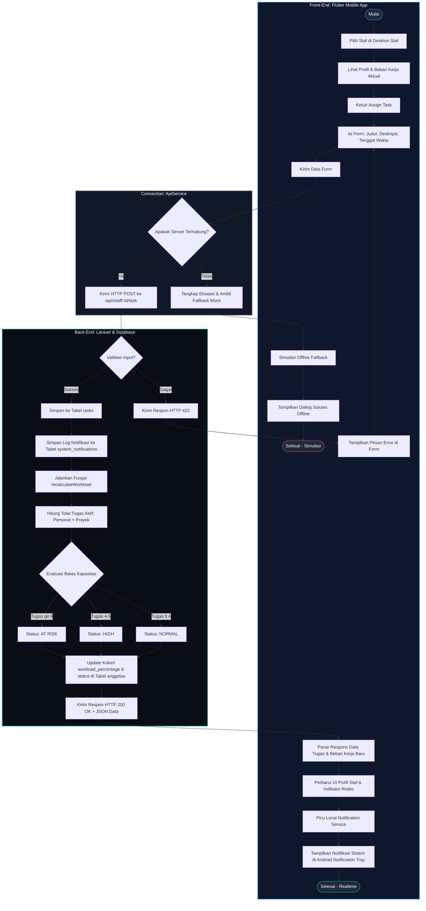

# 🏃‍♂️ Activity Diagram 1 - Penugasan Staf & Perhitungan Beban Kerja

Activity Diagram ini menggambarkan alur kerja (*workflow*) ketika **Executive (Division Lead)** menugaskan tugas baru ke staf, dilanjutkan dengan proses perhitungan otomatis beban kerja oleh **Laravel Backend** secara real-time.

