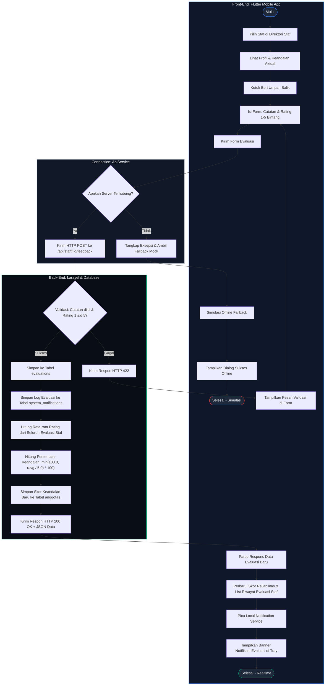

# 🏃‍♂️ Activity Diagram 2 - Evaluasi & Reliabilitas Kinerja Staf

Activity Diagram ini menggambarkan alur kerja (*workflow*) ketika **Executive (Division Lead)** mengirimkan ulasan umpan balik dan rating evaluasi untuk staf, dilanjutkan dengan proses perhitungan rata-rata tingkat keandalan (*reliability score*) secara dinamis oleh **Laravel Backend**.

