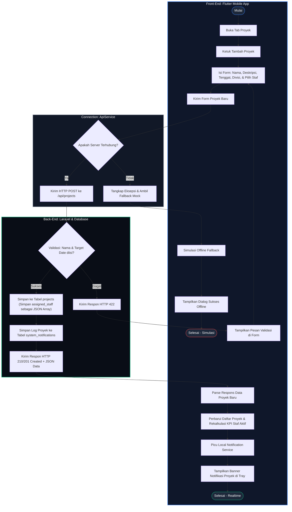

# 🏃‍♂️ Activity Diagram 3 - Pembuatan Proyek Baru & Alokasi Tim

Activity Diagram ini menggambarkan alur kerja (*workflow*) ketika **Executive (Division Lead)** menambahkan proyek baru ke dalam dasbor, memilih divisi penanggung jawab, serta mengalokasikan anggota staf ke dalam proyek tersebut.

