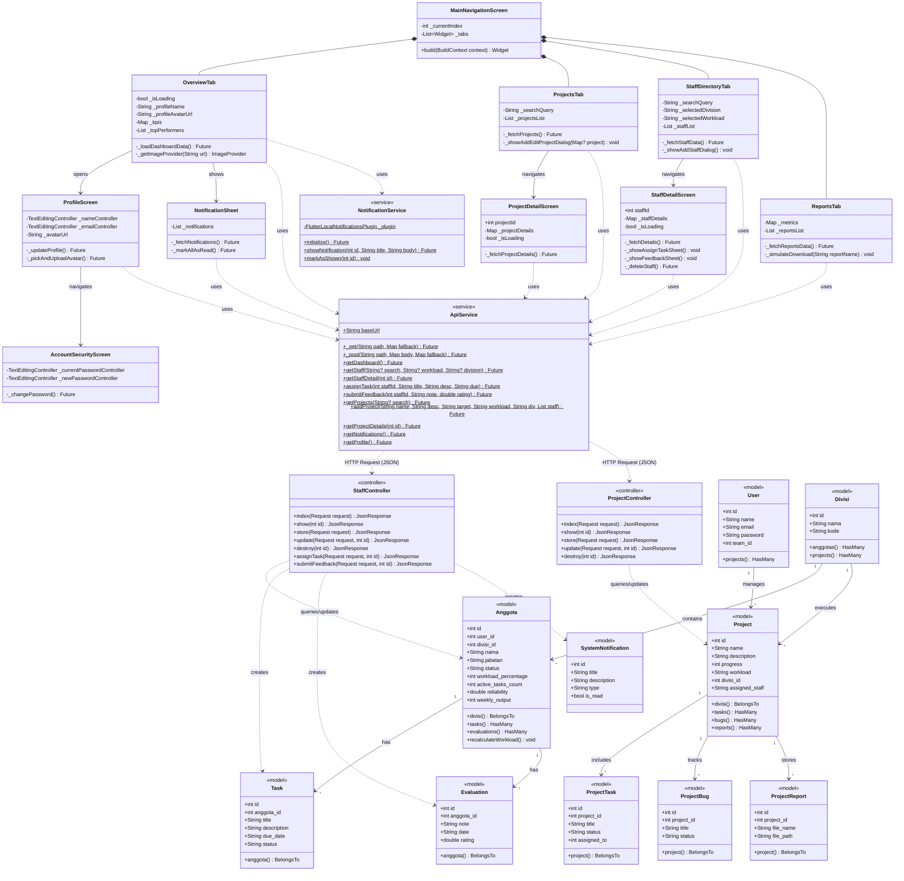

# 🏛️ Class Diagram - Executive Command Dashboard

Class Diagram ini memetakan kelas-kelas utama pada aplikasi mobile **Flutter** (Frontend) serta model data dan kontroler pada **Laravel** (Backend) yang terhubung via REST API.

