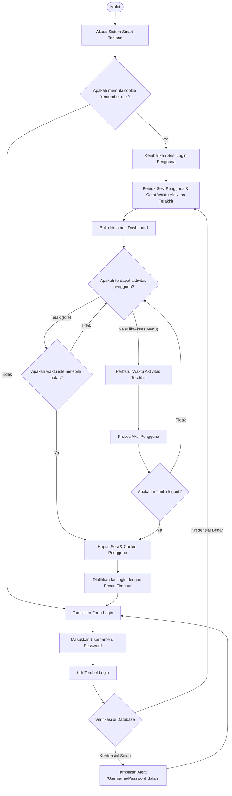
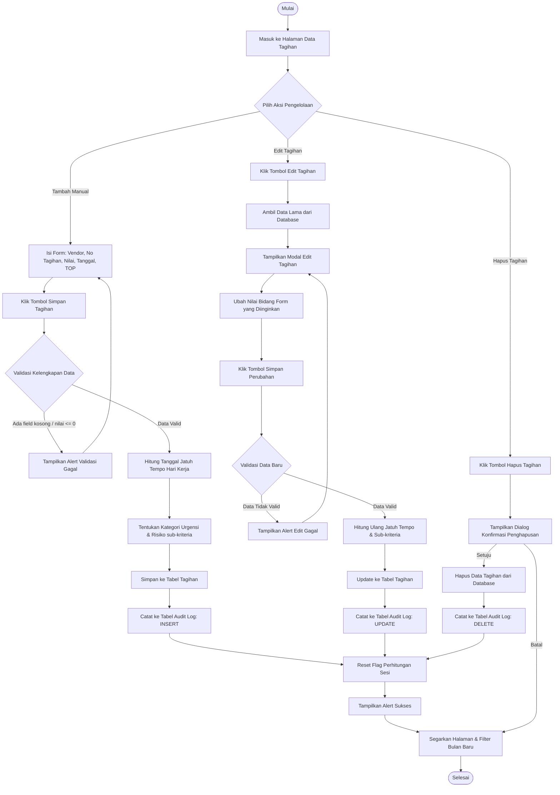
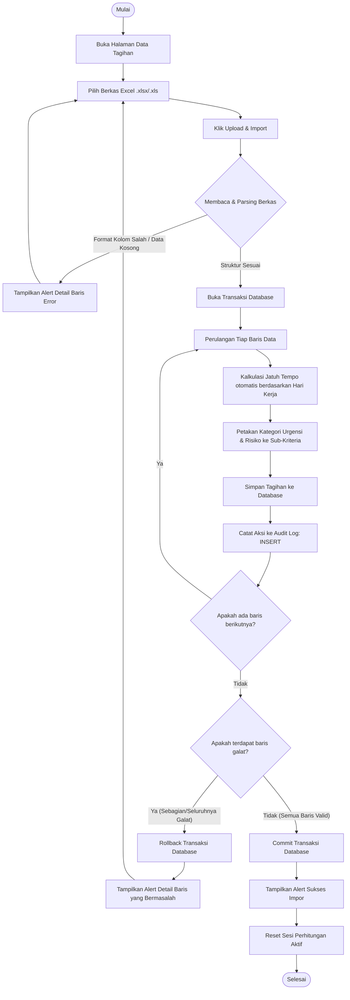
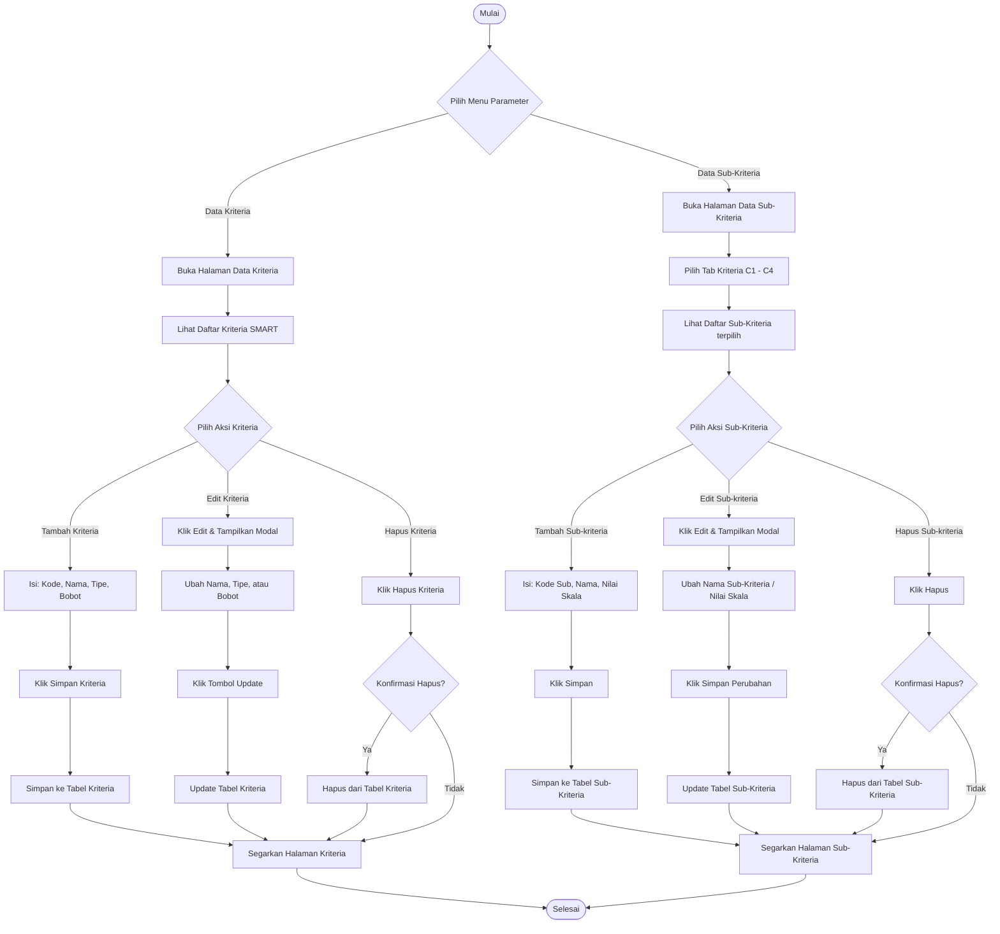

# 🔄 Activity Diagram - Smart Tagihan (Seluruh Kasus Penggunaan)

Laporan ini memuat rancangan **Activity Diagram** komprehensif yang mencakup **seluruh kasus penggunaan (use cases)** di dalam sistem pendukung keputusan pembayaran tagihan **Smart Tagihan**.

---

## 1. Alur Aktivitas: Login, Sesi, dan Proteksi Idle Timeout

Menggambarkan alur masuk pengguna ke dalam sistem, pembentukan sesi, serta mekanisme pengamanan sesi otomatis (*idle timeout*) berdasarkan aktivitas pengguna.



---

## 2. Alur Aktivitas: Pengelolaan Data Tagihan Secara Manual (CRUD)

Menggambarkan alur bisnis bagaimana pengguna melakukan penambahan, pembaruan (edit), dan penghapusan data tagihan secara manual.



---

## 3. Alur Aktivitas: Impor Data Tagihan Massal dari Excel

Menggambarkan alur penambahan data tagihan dalam jumlah besar sekaligus menggunakan file Excel template.



---

## 4. Alur Aktivitas: Pengelolaan Parameter Kriteria & Sub-Kriteria SMART

Menggambarkan alur bagaimana administrator melakukan konfigurasi bobot dan tipe kriteria (Benefit/Cost) serta skala sub-kriteria.



---

## 5. Alur Aktivitas: Proses Eksekusi Perhitungan SMART

Menggambarkan alur simulasi pengambilan keputusan SMART yang memproses seluruh kriteria dan menghasilkan urutan prioritas pembayaran vendor.

```mermaid
flowchart TD
    start_calc([Mulai]) --> open_calc_page[Buka Halaman Perhitungan SMART]
    open_calc_page --> select_period[Pilih Periode Bulan & Tahun]
    select_period --> click_calc[Klik Tombol Hitung Sekarang]
    
    click_calc --> query_tagihan[Ambil Data Tagihan untuk Periode Terpilih]
    query_tagihan --> check_data_exists{Apakah data tagihan ada?}
    
    check_data_exists -- "Tidak Ada" --> show_empty_alert[Tampilkan Pesan: Data Periode Terpilih Kosong]
    show_empty_alert --> select_period
    
    check_data_exists -- "Ada Data" --> query_active_criteria[Ambil Konfigurasi Bobot & Tipe Kriteria dari DB]
    
    query_active_criteria --> calc_min_max[Cari Nilai Minimum & Maksimum tiap kriteria tagihan aktif]
    
    calc_min_max --> loop_tagihan[Perulangan Kalkulasi per Tagihan]
    
    %% SMART ALGORITHM COMPUTATION
    loop_tagihan --> calc_util_c1[Hitung Utility C1 (Nominal Tagihan):<br>Tipe Cost = max-val / max-min]
    calc_util_c1 --> check_c2_tipe{Cek Tipe Kriteria C2}
    
    check_c2_tipe -- "Cost (Aktif)" --> calc_util_c2_cost[Hitung Utility C2 (Jatuh Tempo):<br>Tipe Cost = max-val / max-min]
    check_c2_tipe -- "Benefit" --> calc_util_c2_benefit[Hitung Utility C2 (Jatuh Tempo):<br>Tipe Benefit = val-min / max-min]
    
    calc_util_c2_cost --> calc_util_c3[Hitung Utility C3 (Urgensi):<br>Tipe Benefit = val-min / max-min]
    calc_util_c2_benefit --> calc_util_c3
    
    calc_util_c3 --> calc_util_c4[Hitung Utility C4 (Risiko):<br>Tipe Benefit = val-min / max-min]
    
    calc_util_c4 --> restrict_range[Batasi Seluruh Nilai Utility di range 0.0 s.d 1.0]
    
    restrict_range --> sum_score[Hitung Skor Akhir = jumlah perkalian utility x bobot kriteria]
    
    sum_score --> check_loop_next{Apakah ada tagihan berikutnya?}
    check_loop_next -- "Ya" --> loop_tagihan
    
    check_loop_next -- "Tidak" --> sort_ranking[Urutkan Tagihan Descending menurut Skor Akhir]
    
    sort_ranking --> check_history_db{Cek apakah riwayat periode ini telah tersimpan hari ini?}
    check_history_db -- "Ya" --> update_history_db[Update baris Riwayat Perhitungan: hasil_json]
    check_history_db -- "Tidak" --> insert_history_db[Insert baris baru Riwayat Perhitungan: hasil_json]
    
    update_history_db --> save_session_active[Simpan Data & Periode ke Variabel Sesi Aktif]
    insert_history_db --> save_session_active
    
    save_session_active --> render_accordion_steps[Renders Tampilan Accordion Interaktif 8-Langkah]
    render_accordion_steps --> stop_calc([Selesai])
```
