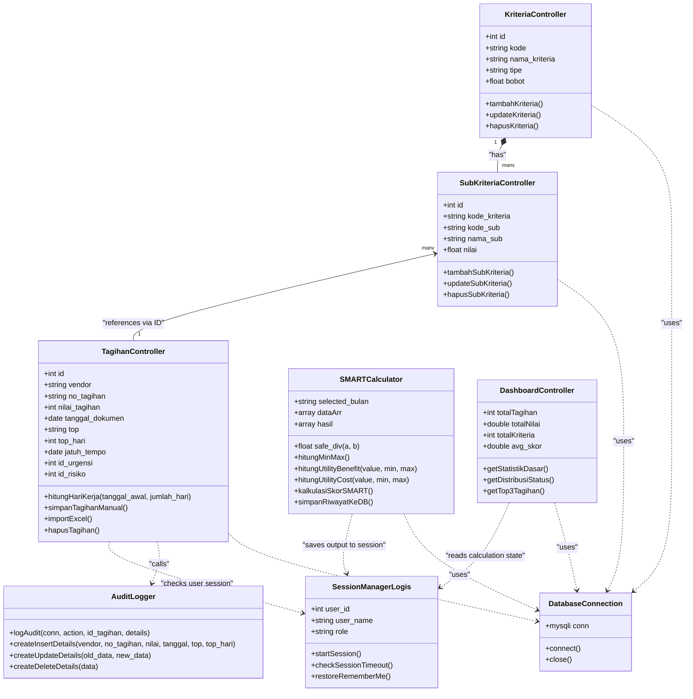

# 🧱 Class Diagram - Smart Tagihan

Class Diagram di bawah memvisualisasikan struktur sistem dari perspektif berorientasi objek logis. Meskipun proyek dibangun di atas bahasa PHP prosedural terstruktur, representasi kelas logis ini memetakan bagaimana modul-modul sistem berinteraksi, memproses data, dan mengakses tabel database.

### Keterangan Komponen Struktur:
1. **`DatabaseConnection` (`config/koneksi.php`):** Menyediakan koneksi database MySQL (`$conn`) ke seluruh modul pengontrol transaksi data.
2. **`SessionManagerLogis` (`config/SessionManager.php` & `check_session.php`):** Mengatur kredensial masuk pengguna terautentikasi (`user_id`, `role`), durasi sesi idle, dan kunci sesi masukan.
3. **`AuditLogger` (`config/audit_log.php`):** Memproses serialisasi objek data ke format JSON untuk mencatat jejak audit penambahan/pengubahan data tagihan.
4. **`TagihanController` (`tagihan.php`, `proses.php`, dll):** Mengatur input data manual, unggahan file menggunakan PhpSpreadsheet, kalkulasi tanggal jatuh tempo, dan penghapusan data per bulan.
5. **`SMARTCalculator` (`perhitungan_modern.php`):** Jantung proses pemrosesan keputusan. Mengatur formula perhitungan Min/Max kriteria, kalkulasi utility benefit & cost, pembobotan prioritas, penyusunan ranking, serta pencatatan arsip ke riwayat perhitungan.
6. **`DashboardController` (`dashboard.php`):** Mengagregasikan data kalkulasi prioritas dari sesi aktif untuk divisualisasikan dalam status ringkasan prioritas tinggi, sedang, rendah dan grafik.
