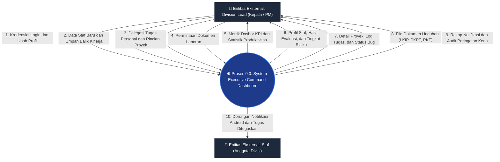

# 📊 Data Flow Diagram (DFD) - Executive Command Dashboard

Dokumentasi Aliran Data (Data Flow Diagram) ini memetakan bagaimana data masuk, diproses oleh sistem, disimpan ke dalam penyimpanan data (data store), dan dikeluarkan ke entitas luar pada **Executive Command Dashboard**.

---

## 1. Context Diagram (DFD Level 0)

Context Diagram menggambarkan batas sistem dan aliran data luar ke/dari sistem Executive Command Dashboard dengan entitas eksternal.

---

## 2. DFD Level 1

DFD Level 1 menguraikan sistem utama menjadi 5 proses utama dan interaksinya dengan data store (tabel database Laravel).

```mermaid
flowchart TD
    %% Entities
    Executive["👤 Division Lead (Kepala / PM)"]
    Staff["👤 Staf (Anggota Divisi)"]

    %% Sub-Processes
    P1(("Proses 1.0\nKelola Autentikasi\ndan Akun"))
    P2(("Proses 2.0\nVisualisasi\nDashboard KPI"))
    P3(("Proses 3.0\nKelola Direktori\nstaf dan Kinerja"))
    P4(("Proses 4.0\nKelola Siklus\nProyek dan Tugas"))
    P5(("Proses 5.0\nDistribusi Laporan\ndan Notifikasi"))

    %% Data Stores
    D1[("D1: users")]
    D2[("D2: divisis")]
    D3[("D3: anggotas")]
    D4[("D4: tasks")]
    D5[("D5: evaluations")]
    D6[("D6: projects")]
    D7[("D7: project_tasks")]
    D8[("D8: project_bugs")]
    D9[("D9: project_reports")]
    D10[("D10: system_notifications")]

    %% P1 Flows
    Executive -->|"Kredensial dan Info Profil"| P1
    P1 -->|"Validasi dan Simpan"| D1
    D1 -->|"Data Akun"| P1
    P1 -->|"Status Akun dan Profil"| Executive

    %% P2 Flows
    Executive -->|"Permintaan Metrik Dasbor"| P2
    D6 -->|"Data Progress Proyek"| P2
    D3 -->|"Data Efisiensi dan Produktivitas"| P2
    P2 -->|"Metrik KPI dan Chart Mingguan"| Executive

    %% P3 Flows
    Executive -->|"Input Staf / Rating / Feedback"| P3
    P3 -->|"Pembaruan Profil / Evaluasi"| D3
    P3 -->|"Tugas Personal Baru"| D4
    P3 -->|"Catatan Penilaian"| D5
    D3 -->|"List Staf dan Tingkat Risiko"| P3
    D5 -->|"Rata-rata Reliabilitas Staf"| P3
    P3 -->|"Visualisasi Profil dan Kinerja"| Executive
    P3 -->|"Info Recalculate Workload"| P5

    %% P4 Flows
    Executive -->|"Data Proyek dan Alokasi Anggota"| P4
    P4 -->|"Tulis Proyek, Tugas, Bug"| D6
    P4 -->|"Tulis Task Proyek"| D7
    P4 -->|"Tulis Bug Proyek"| D8
    D6 -->|"Detail Proyek dan Bug Log"| P4
    P4 -->|"Status Proyek dan Monitoring"| Executive

    %% P5 Flows
    Executive -->|"Unduh Laporan"| P5
    P5 -->|"Tulis Notifikasi Sistem"| D10
    D10 -->|"List Notifikasi"| P5
    D9 -->|"File Laporan (LKIP, dll)"| P5
    P5 -->|"Baki Notifikasi OS"| Staff
    P5 -->|"File Laporan dan Audit Notifikasi"| Executive

    %% Cross-Process Recalculation Trigger (Tugas masuk -> recalculate -> system_notif)
    D4 -.->|"Tugas Personal Baru"| P5
    D7 -.->|"Tugas Proyek Baru"| P5

    %% Styles
    style P1 fill:#1E3A8A,stroke:#3B82F6,color:#fff
    style P2 fill:#1E3A8A,stroke:#3B82F6,color:#fff
    style P3 fill:#1E3A8A,stroke:#3B82F6,color:#fff
    style P4 fill:#1E3A8A,stroke:#3B82F6,color:#fff
    style P5 fill:#1E3A8A,stroke:#3B82F6,color:#fff
    style Executive fill:#1E293B,stroke:#9CA3AF,color:#fff
    style Staff fill:#1E293B,stroke:#9CA3AF,color:#fff
    style D1 fill:#064E3B,stroke:#10B981,color:#fff
    style D2 fill:#064E3B,stroke:#10B981,color:#fff
    style D3 fill:#064E3B,stroke:#10B981,color:#fff
    style D4 fill:#064E3B,stroke:#10B981,color:#fff
    style D5 fill:#064E3B,stroke:#10B981,color:#fff
    style D6 fill:#064E3B,stroke:#10B981,color:#fff
    style D7 fill:#064E3B,stroke:#10B981,color:#fff
    style D8 fill:#064E3B,stroke:#10B981,color:#fff
    style D9 fill:#064E3B,stroke:#10B981,color:#fff
    style D10 fill:#064E3B,stroke:#10B981,color:#fff
```

