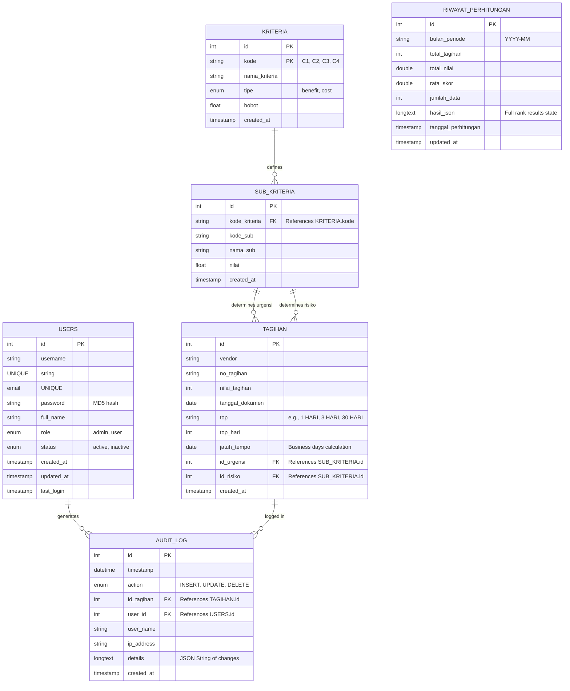

# 🗄️ Entity Relationship Diagram (ERD) - Smart Tagihan

Entity Relationship Diagram (ERD) menggambarkan hubungan logis dan konseptual antar entitas data dalam database `db_smart` yang digunakan oleh sistem pendukung keputusan pembayaran tagihan.

### Relasi Bisnis Utama:
1. **KRITERIA & SUB_KRITERIA:** Setiap kriteria (seperti C3 Urgensi dan C4 Risiko) dipecah menjadi beberapa parameter penilaian kualitatif di sub-kriteria. Hubungan ini dihubungkan secara dinamis melalui kolom `kode_kriteria` di tabel sub-kriteria yang merujuk pada `kode` di tabel kriteria.
2. **SUB_KRITERIA & TAGIHAN:** Data tagihan yang masuk memiliki relasi langsung ke parameter sub-kriteria untuk kriteria C3 (Urgensi) dan C4 (Risiko) melalui kunci tamu `id_urgensi` dan `id_risiko`. Nilai parameter ini digunakan dalam formula SMART.
3. **USERS, TAGIHAN & AUDIT_LOG:** Setiap kali ada aksi pengubahan data tagihan (tambah manual, impor Excel, edit, atau hapus), sistem mencatat informasi pengguna (`user_id`, `user_name`), identitas tagihan (`id_tagihan`), alamat IP, serta detail lengkap perubahan ke dalam tabel `audit_log`.
4. **RIWAYAT_PERHITUNGAN:** Entitas ini berdiri sendiri (*isolated*) untuk menampung *snapshot* historis hasil akhir perhitungan per periode bulan dalam format JSON. Hal ini berguna untuk menyajikan laporan statis tanpa dipengaruhi oleh perubahan data tagihan aktif di kemudian hari.
