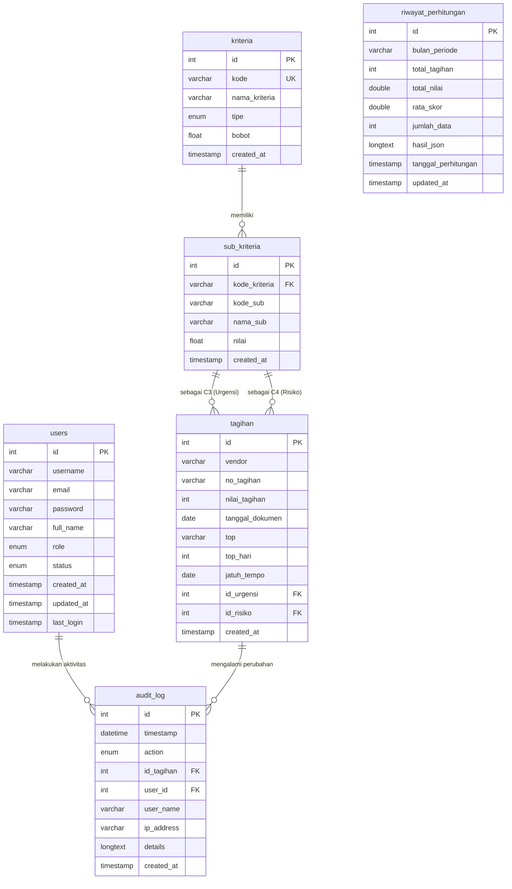

# 📊 Logical Record Structure (LRS) - Smart Tagihan

Logical Record Structure (LRS) menggambarkan struktur relasi antar tabel database secara logis, lengkap dengan Primary Key (PK), Foreign Key (FK), tipe data, dan kardinalitas hubungan antar entitas.

### Keterangan Kardinalitas:
* **`kriteria` ke `sub_kriteria` (`1:N`):** Satu kriteria dapat memiliki satu atau banyak sub-kriteria. Satu sub-kriteria hanya merujuk pada satu kriteria tertentu.
* **`sub_kriteria` ke `tagihan` (`1:N`):** Satu data nilai sub-kriteria (Urgensi / Risiko) dapat digunakan oleh banyak data tagihan.
* **`users` ke `audit_log` (`1:N`):** Satu pengguna dapat memicu pencatatan banyak log aktivitas perubahan data.
* **`tagihan` ke `audit_log` (`1:N`):** Satu data tagihan dapat mengalami beberapa kali perubahan (INSERT, UPDATE, DELETE) yang tercatat dalam log audit.
