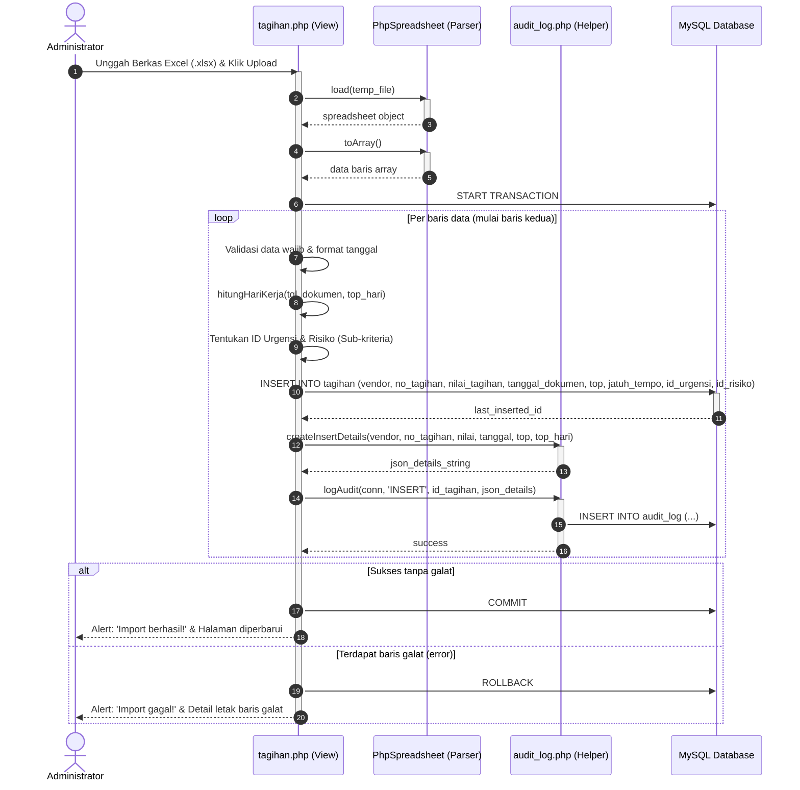
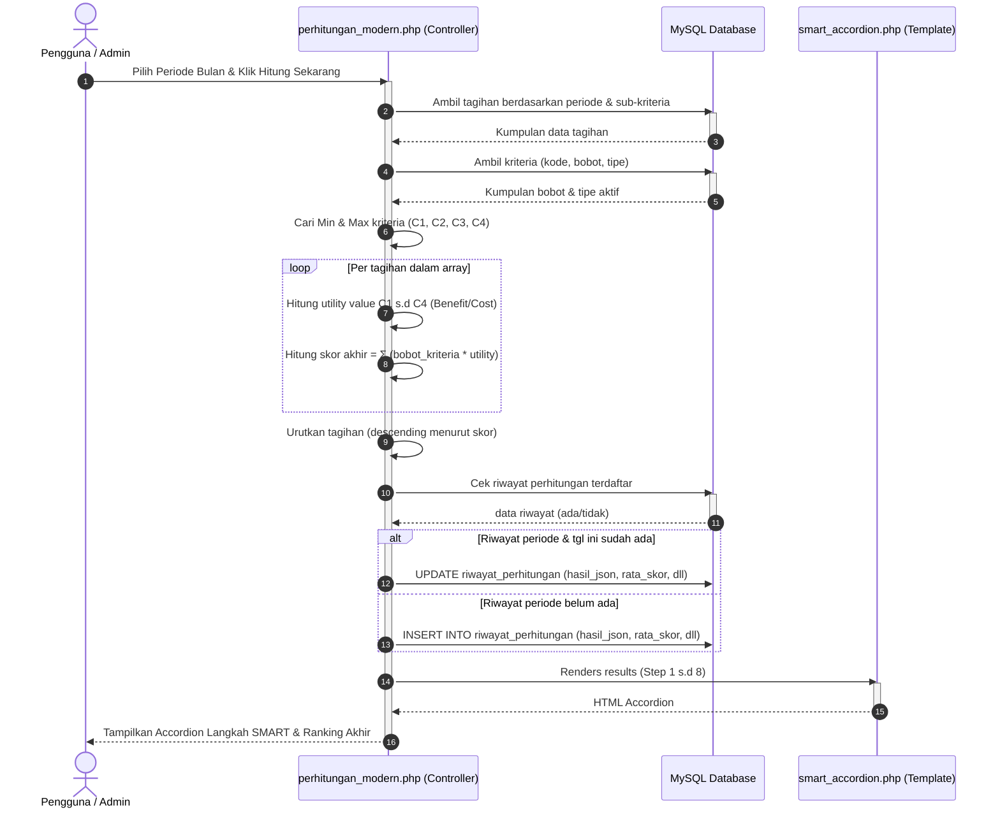

# 🎬 Sequence Diagram - Smart Tagihan

Sequence Diagram menggambarkan interaksi antar komponen sistem secara berurutan berdasarkan waktu ketika mengeksekusi operasi bisnis. Diagram di bawah menyajikan interaksi untuk proses **Unggah Tagihan Excel** dan **Perhitungan SMART**.

---

## A. Interaksi Proses: Unggah Data Tagihan Excel

---

## B. Interaksi Proses: Eksekusi Perhitungan SMART

