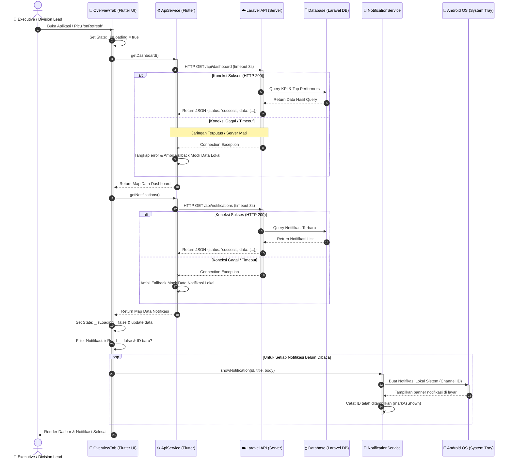

# ⏱️ Sequence Diagram 1 - Sinkronisasi Dasbor & Fallback Offline

Sequence Diagram ini menggambarkan interaksi pesan antara aplikasi **Flutter**, **Laravel API**, **Database**, dan **Android OS** saat memuat dasbor eksekutif dengan mekanisme pertahanan kegagalan jaringan (*network fallback*).

