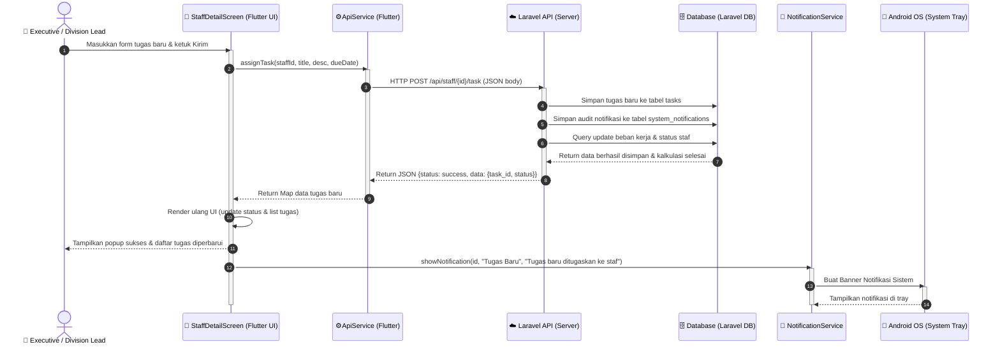

# ⏱️ Sequence Diagram 2 - Pendelegasian Tugas Baru & Notifikasi Android

Sequence Diagram ini menggambarkan sekuens pesan interaktif ketika **Executive (Division Lead)** mendelegasikan tugas personal baru ke staf dari form antarmuka detail staf Flutter, dilanjutkan dengan pemrosesan di database Laravel, dan pemicu banner notifikasi di Android OS.

