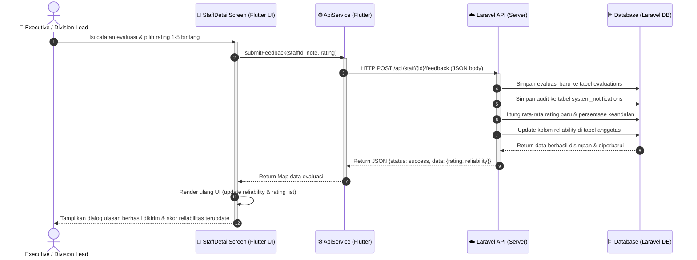

# ⏱️ Sequence Diagram 3 - Submit Umpan Balik & Update Skor Kinerja Staf

Sequence Diagram ini menggambarkan sekuens pesan interaktif ketika **Executive (Division Lead)** mengirimkan ulasan evaluasi kualitatif dan rating numerik untuk staf, dilanjutkan dengan pemrosesan di database Laravel untuk pembaruan skor reliabilitas kepegawaian secara real-time.

