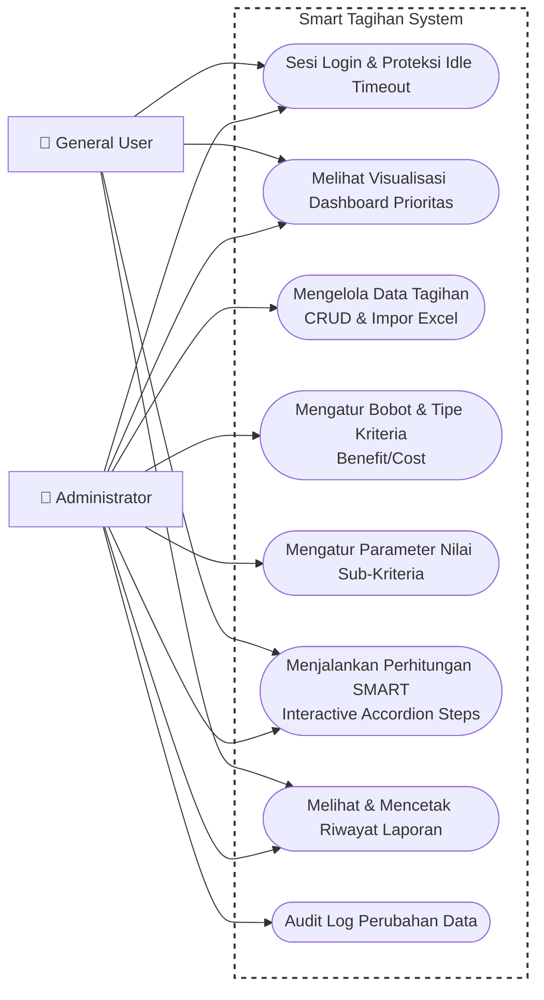

# 👥 Use Case Diagram - Smart Tagihan

Use Case Diagram menggambarkan interaksi antara pengguna sistem (Aktor) dan kasus penggunaan (Fitur/Fungsi) yang disediakan di dalam sistem pendukung keputusan pembayaran tagihan.

### Deskripsi Aktor & Hak Akses (Role Mapping):

Sistem membagi hak akses ke dalam 2 peran utama:

1. **Administrator (admin):**
   * Memiliki akses penuh terhadap seluruh modul sistem.
   * Bertanggung jawab melakukan pengelolaan kriteria (`C1` s.d `C4`), penentuan bobot pentingnya masing-masing kriteria, serta konfigurasi parameter nilai sub-kriteria.
   * Mengimpor data tagihan vendor dari Excel, mengedit, atau menghapus tagihan secara massal.
   * Meninjau jejak audit log aktivitas transaksi pada sistem.
2. **General User (user):**
   * Memiliki hak akses terbatas yang berfokus pada pemantauan hasil keputusan dan laporan.
   * Dapat melihat grafik distribusi prioritas pembayaran di halaman Dashboard.
   * Menjalankan simulasi perhitungan SMART untuk melihat urutan ranking tagihan pada bulan terpilih.
   * Mengunduh atau mencetak laporan riwayat perhitungan bulanan.
