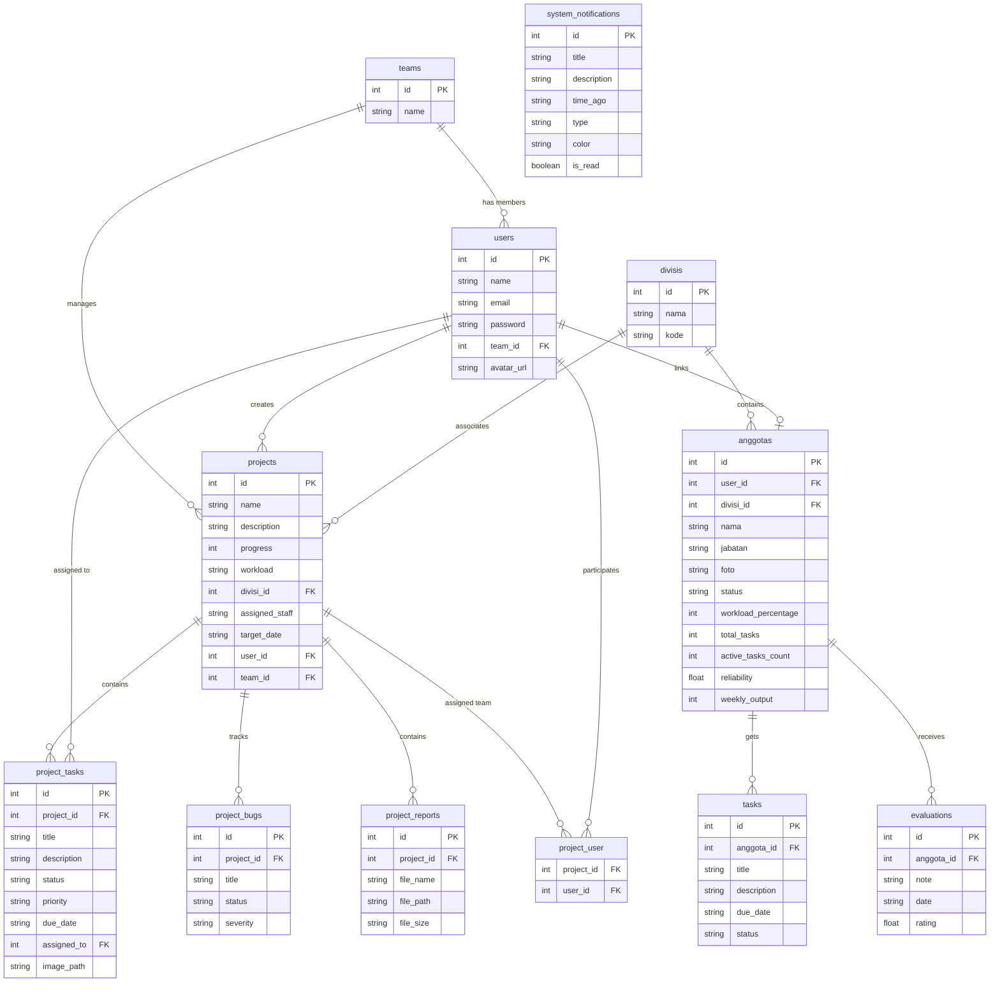

# 🗄️ Entity Relationship Diagram (ERD) - Executive Command Dashboard

Entity Relationship Diagram (ERD) ini mendokumentasikan skema dan relasi antar tabel pada database **Laravel** yang digunakan oleh Executive Command Dashboard.

### Deskripsi Tabel & Relasi:

1. **divisis & anggotas:**
   * Setiap staf (`anggotas`) terdaftar dalam satu divisi (`divisis`) melalui kunci asing `divisi_id` (relasi 1-ke-banyak).

2. **anggotas, tasks, & evaluations:**
   * Data `anggotas` memiliki banyak tugas personal (`tasks`) yang didelegasikan oleh pimpinan.
   * Data `anggotas` memiliki catatan evaluasi (`evaluations`) untuk menghitung performa (keandalan / `reliability`) secara rata-rata dinamis.

3. **users & anggotas:**
   * Pimpinan (`users` berhak login ke dasbor) terhubung secara opsional (1-ke-1) ke data staf (`anggotas`) melalui `user_id` untuk menghubungkan pekerjaan proyek dan personal mereka.

4. **projects & project_tasks/bugs/reports:**
   * Setiap proyek (`projects`) dinaungi oleh satu divisi (`divisi_id`) dan tim (`team_id`).
   * Proyek memiliki relasi 1-ke-banyak ke `project_tasks` (detail tugas tim), `project_bugs` (kutu/isu sistem), dan `project_reports` (laporan file unggahan eksternal).

5. **system_notifications:**
   * Berdiri sendiri sebagai audit trail aktivitas sistem, menyimpan peristiwa seperti keberhasilan pengerjaan tugas, peringatan kapasitas beban kerja staf, dan progres proyek.
