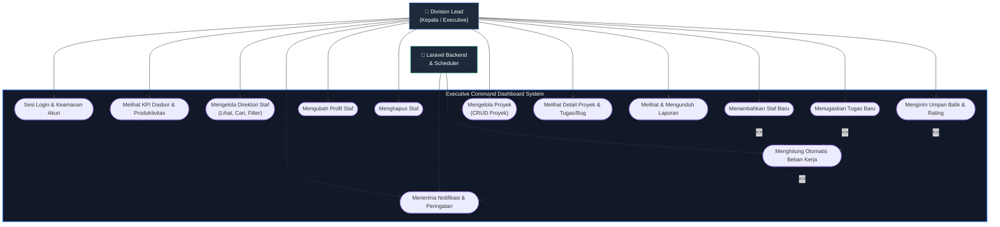

# 👥 Use Case Diagram - Executive Command Dashboard

Use Case Diagram ini menggambarkan interaksi antara **Division Lead (Kepala / Executive)** dan **Laravel Backend/System Scheduler** sebagai aktor dengan sistem Executive Command Dashboard.

### Deskripsi Aktor & Hubungan Sistem:

1. **Division Lead (Kepala / Executive) [Aktor Utama]:**
   * Mengawasi seluruh kinerja divisi melalui dasbor metrik visual (weekly productivity, top performers).
   * Melakukan administrasi kepegawaian (menambah, memperbarui, atau menghapus data staf).
   * Memantau beban kerja masing-masing staf dan mendelegasikan tugas personal baru jika beban kerja staf masih aman.
   * Memberikan evaluasi berupa ulasan kualitatif dan rating numerik untuk menghitung keandalan (*reliability*) staf.
   * Mengelola siklus proyek (tambah proyek baru, pembaruan, hapus, dan memantau tugas/bug).
   * Meninjau dan mengunduh laporan penting divisi (LKIP, PKPT, RKT).

2. **Laravel System / Scheduler [Aktor Pendukung]:**
   * Menghitung ulang secara otomatis persentase beban kerja staf (*workload percentage*) dan tingkat risiko staf (`NORMAL`, `HIGH`, `AT RISK`) berdasarkan jumlah tugas aktif.
   * Menghitung output mingguan staf secara dinamis berdasarkan tugas personal dan proyek yang diselesaikan dalam 7 hari terakhir.
   * Membuat log peringatan sistem (`system_notifications`) jika kapasitas staf melebihi batas (misalnya staf bertatus `AT RISK`).
   * Memicu pengiriman *local push notification* di aplikasi mobile Flutter.
